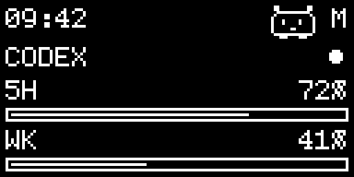
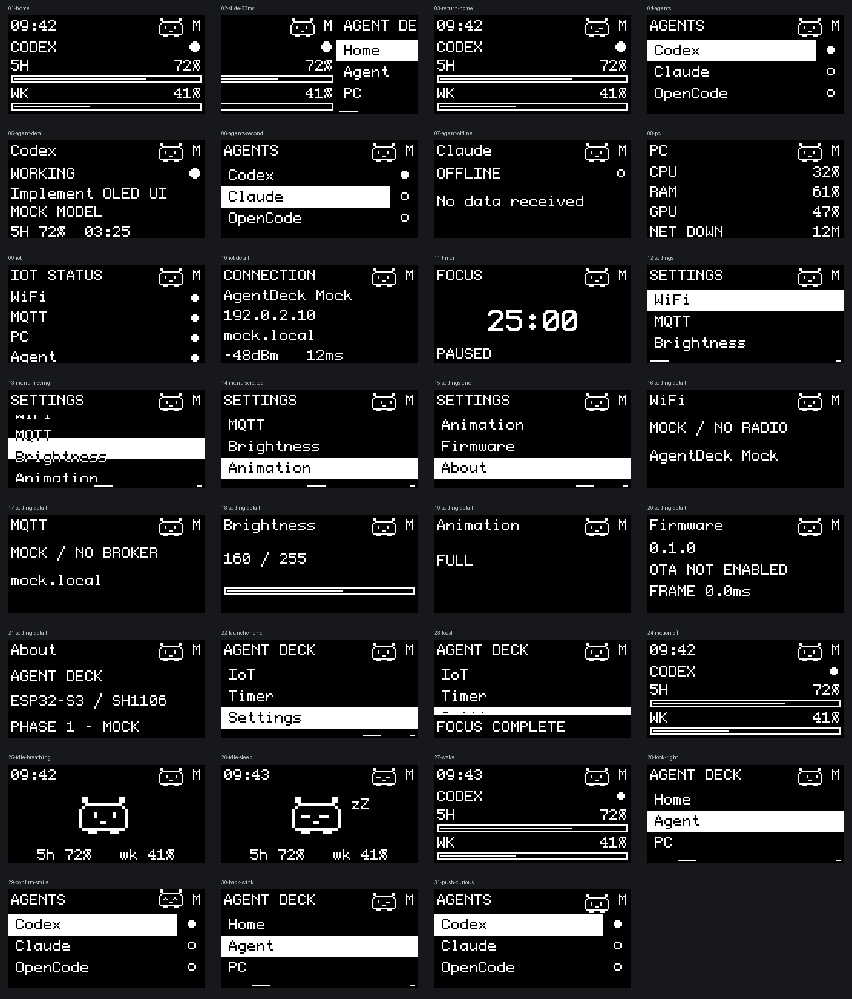

# Agent Deck

A tiny OLED **desk buddy** that quietly watches your AI coding agents — then turns into the control deck for them, for your PC, and for your focus.

Run a Codex / Claude / OpenCode session on your desktop and this little ESP32-S3 terminal lights up with what is *actually* happening: who is online, who is working, how much Codex quota is really left, what your CPU / RAM / GPU are doing — with a blinking, look-at-your-knob companion living on the same 128×64 pixels.

**v0.3.0 · every number on screen is real.** No mocks, no fake usage bars, no pretend "working" states. If there is no data, the deck tells you plainly: `--`.

<div align="center">


</div>

<div align="center">



*The buddy. It follows your knob, blinks at the edge of sleep, and dozes off when you walk away.*

</div>

---

## Why it exists

Monochrome OLEDs are usually dashboards — grids of numbers. We wanted something you *notice*: a character with real eyes that reacts to you, a UI that slides and breathes instead of blinking frames, all on a $5 board with zero PSRAM. And because "an AI agent terminal" filled with invented data is worse than useless, everything was built around one rule:

## The deck

Six pages live under a knob-driven launcher with six original 24px line icons:

| Page | What it shows (all real) |
| --- | --- |
| **Home** | NTP clock (or `--:--`), the buddy, Codex online / working state and true 5 h & weekly quota bars |
| **Agents** | Live status of your Codex / Claude / OpenCode sessions: online, working, current task, model — the detail view pairs each agent with the buddy's eyes |
| **Computer** | CPU / RAM / GPU load bars and real network downlink kbit/s |
| **Network** | Deep-dive status of the device's Wi-Fi / MQTT / NTP connection |
| **Focus** | A 25-minute focus timer you pause, nudge by ±1 minute and reset from the knob |
| **Settings** | Brightness, motion level (Full / Reduced / Off), version info |

<div align="center">



*Design-v2 page preview (see `docs/design-v2.md`).*

</div>

## Highlights

- **A companion, not a widget.** Eyes are drawn from geometry and interpolated — gaze, eyelids, smile and "lift" are tweened, so there are no one-frame jumps. Spin the knob and the buddy's eyes follow; `CONFIRM` makes it happy, `PUSH` curious, `BACK` gives you a wink. Idle 20 s and it settles into big standby eyes; 45 s and it falls asleep. In Reduced / Off motion modes it stays politely static and never blocks an action.
- **One OLED, buttery motion.** A 33 ms frame scheduler, interruptible tweens (Linear / EaseOutCubic / EaseInOutCubic), and an 8×8 dirty-tile renderer that pushes *only changed pixels* over 400 kHz I2C. Screens slide and interrupt cleanly; static menus stop refreshing entirely.
- **Your agents, honestly represented.** Bridge reports *online* only when real heartbeats arrive and *working* only from a real task runner or event feed. Agent detail lets you send `confirm`, `cancel`, `stop` — the deck shows `COMMAND SENT`, then `COMMAND COMPLETE` only when the real handler acknowledges, or `COMMAND TIMEOUT` after 12 s.
- **A desktop bridge in Rust.** One Windows EXE bundles a local MQTT broker, so home users never touch Mosquitto. It samples psutil + `nvidia-smi`, counts real network bytes, and reads Codex quota through the read-only app-server — never touching `auth.json`, never firing a model request, never hiding an unavailable window as zero.
- **BLE provisioning, no secrets in the repo.** First boot shows `BLUETOOTH SETUP`; the `provision` tool collects Wi-Fi / MQTT over BLE with hidden input, stores credentials only in ESP32 NVS. `Secrets.h` and `bridge/config.json` are gitignored.
- **Built like firmware you ship.** Networking lives on Core 0 behind a fixed snapshot queue; the UI thread never blocks on DNS, sockets or OTA. UI host tests capture the real U8g2 tile writes and assert the simulated OLED RAM equals the framebuffer every frame. CI compiles, tests, packages and boots the EXE on every push.

---

## Quick start

### Easiest: Windows single EXE

Double-click `AgentDeck.exe` from a [release](https://github.com/ptsfdtz/esp32-agent-hub/releases). It bundles the Bridge, Mosquitto and required DLLs; unpacks to `%LOCALAPPDATA%\AgentDeck`, runs hidden, and registers login autostart for the current user. No Rust, Python or manual MQTT install. A second launch is ignored. Codex quota requires Codex installed and signed in on this machine; a brand-new device still needs one-time BLE provisioning, with MQTT pointed at the PC's LAN IP on port **1884**.

Build it locally:

```powershell
powershell -ExecutionPolicy Bypass -File tools/build-exe.ps1   # → build/dist/AgentDeck.exe
```

The build machine needs Rust/MSVC and Mosquitto (default `C:\Program Files\mosquitto`, override with `-MosquittoDirectory`). Runtime config lives in `%LOCALAPPDATA%\AgentDeck\bridge\config.json`, logs in the sibling `.state`. GitHub Actions builds firmware, runs UI + Rust tests, and verifies the packaged EXE on every push / PR; pushing a `v*` tag publishes a release with the EXE and firmware artifacts.

<details>
<summary>Windows background-service notes</summary>

The current home setup talks to Mosquitto on **1884** via `bridge/mosquitto.local.conf`. Existing firmware + config can be attached to login autostart once:

```powershell
powershell -ExecutionPolicy Bypass -File tools/install-background.ps1
```

A supervisor then checks the MQTT broker and Bridge every 5 s and relaunches them after a crash — no terminal needed. Wi-Fi / MQTT drops are reconnected by firmware and Bridge automatically. Logs: `bridge/.state/`. Your PC should keep a stable LAN address (reserve it via DHCP) since the device dials it directly.

Remove autostart:

```powershell
Remove-ItemProperty HKCU:\Software\Microsoft\Windows\CurrentVersion\Run -Name AgentDeckBackground
```

(The current background process keeps running after this.)

</details>

> Upgrading? End `AgentDeck` **and** its PowerShell / Bridge / Mosquitto children in Task Manager first, then run the new EXE.

### Build the firmware yourself

From the repo root:

```powershell
python -m pip install platformio
python -m platformio run -e agentdeck
```

Pinned toolchain: Espressif32 **6.12.0** / arduino-esp32 **2.0.17** / U8g2 **2.36.15** / PubSubClient **2.8** / ArduinoJson **6.21.5**. Target is ESP32-S3-DevKitC-1 N8 with 8 MB Flash and no PSRAM dependency — keep the flash size matching your board.

### Run the desktop Bridge

```powershell
cargo build --release --manifest-path bridge/Cargo.toml
bridge/target/release/agentdeck-bridge configure --host YOUR_BROKER_IP --device agentdeck-01
bridge/target/release/agentdeck-bridge service --config bridge/config.json
```

Broker account goes through environment variables (`AGENTDECK_MQTT_USER` / `AGENTDECK_MQTT_PASSWORD`) — never into the repo. The Bridge uses your existing broker; it does not deploy one for production.

Codex quota is read read-only from the local `codex app-server` (queried every 60 s, cached ≤ 120 s). A successful app-server init means *Codex online*; only a real task runner or session-event heartbeat means *Working*; an unauthenticated or unavailable quota API shows as unknown — never as a fake `0%`.

Point agents to real data with `run` (wraps a real CLI task) or `feed` (streams real events):

```powershell
bridge/target/release/agentdeck-bridge run --agent codex --task "Review changes" -- codex exec "Review current changes without editing files"
your-event-adapter | bridge/target/release/agentdeck-bridge feed --agent claude
```

### Provision over BLE

New devices show `BLUETOOTH SETUP`. On the PC:

```powershell
bridge/target/release/agentdeck-bridge provision
```

Follow the prompts for Wi-Fi, MQTT host / port and optional credentials. The device validates, saves to NVS, and reboots. Switching networks later: hold **BACK** while powering on, then run the same command. No source edit or recompile needed for new devices.

---

## Controls

Menu = rotate to select, `CONFIRM` to enter. A short knob `PUSH` does **not** enter.

| On page | Knob | PUSH | CONFIRM | BACK |
| --- | --- | --- | --- | --- |
| HOME | open page menu | — | page menu | stay on HOME |
| Page menu / AGENT / SETTINGS | smooth select | — | enter selection | back one level |
| PC | open page menu | — | page menu | page menu |
| IOT | open page menu | — | network details | page menu |
| TIMER | paused: ±1 min | — | start / pause | page menu |
| Brightness / motion detail | adjust value | — | — | back to settings list |
| Agent detail | — | — | send human `confirm` | send `cancel` + back |

- Long-press **BACK** anywhere returns to HOME. On an Agent detail, long-press PUSH sends `stop`.
- Home / PC ignore long-PUSH (no phantom data changes). On the Timer, long-PUSH resets to 25 minutes.
- Standby's first input only wakes the panel — it never fires a remote command. Long-press threshold is 700 ms.
- `COMMAND SENT` means written to MQTT; only a matching real handler ack yields `COMMAND COMPLETE`. Unsupported actions are rejected; no ack within 12 s shows `COMMAND TIMEOUT`.
- Brightness and animation settings live in RAM; Full / Reduced / Off visuals behave as before.

## Wiring

1.3″ 128×64 SH1106, `U8G2_SH1106_128X64_NONAME_F_HW_I2C` at 400 kHz I2C.

| Signal | GPIO |
| --- | --- |
| CONFIRM / CON | 15 |
| SDA / SCL | 8 / 9 |
| PUSH / PSH | 6 |
| Encoder TRA / TRS | 4 / 5 |
| BACK / BAK | 7 |
| Power | 3.3V / GND |

Inputs are pull-up, pressed to ground. If rotation feels inverted, flip only `EncoderDirection` in `Config.h`. `hardware/hardware.ino` stays as a preserved wiring test — not the product entry point.

## Network & reliability

- Wi-Fi / MQTT / NTP / OTA run in a dedicated **Core 0** task; the main loop exchanges snapshots and commands through fixed zero-wait queues. No shared mutable Model; MQTT callbacks never touch the OLED.
- Wi-Fi and MQTT reconnect independently with exponential backoff (1, 2, 4 … 60 s, plus jitter). No real heartbeat for 15 s ⇒ Agent / PC go offline. The Focus Timer keeps using `millis()`.
- Task-completed events surface as toasts — no extra pages.
- Connection, topic and JSON contracts (status / usage / task / command / ack / telemetry), NTP timestamp rules, and OTA details live in [docs/communication.md](docs/communication.md).

## OTA & upgrades

8 MB dual-OTA layout (`agentdeck-usb` uses native USB CDC instead of UART; firmware outputs to `.pio/build/agentdeck/firmware.bin`). **The first move from an older layout must be a full USB/UART partition-table flash** — don't OTA-push over an old layout. Afterwards ArduinoOTA can push updates; the OTA service only starts when a password is configured (`Secrets.h`), so an unset password simply disables remote upgrades.

## Diagnostics

Via serial monitor (`python -m platformio device monitor -p COM7 -b 115200`):

- lowercase `s` — `frames / render_us / max_us / over_budget / input_overflow / heap / min_heap`
- lowercase `d` — probe GPIO8/9 for 0x3C / 0x3D (only run on demand, not during frame tests)
- lowercase `q` — read current state · lowercase `f` — dump the OLED framebuffer (has serial overhead)

## Verification & honesty

- Host UI tests run the real state machine against the real U8g2 framebuffer; sample data lives only in `tests/fixtures`, never in firmware.
- Communication tests use real OS data collection, a local TCP broker on `127.0.0.1`, production C++ JSON parsing, acks, duplicate commands, broker restarts, and real test-task stops.
- CI (`.github/workflows/build.yml`) builds firmware, runs `tools/check.py` / network checks, `cargo test`, then packages and boots the single EXE.

```powershell
python -m pip install ziglang pillow
python tools/check.py
python tools/check_network.py
python -m pip install -r bridge/requirements-test.txt
python tools/check_mqtt.py
```

- Compiles and local comms tests cannot replace real-hardware validation: Wi-Fi-loss input feel, OLED frame pacing, OTA write / recovery, and multi-hour heap stability. What has actually been verified on hardware is tracked in [docs/hardware-status-validation.md](docs/hardware-status-validation.md); protocol and network notes in [docs/network-validation.md](docs/network-validation.md).

## Project layout

```text
src/config/        fixed parameters, real network config entry
src/hardware/      OLED / GPIO / encoder interrupts
src/input/         input events, debounce, quadrature state machine
src/models/        real Agent / PC / network / device state
src/network/       Core 0 network task, JSON protocol, reconnect backoff
src/ui/            animations, frame scheduling, screens, Renderer, buddy
src/screens/       the six pages + buddy drawing, bound to the real Model
bridge/            Rust PC monitor, Codex quota, task runners, event feed, command handlers
tests/             UI / protocol / Bridge tests (fixtures are test-only)
tools/             build & verify scripts, config generation, local MQTT integration
```

Original design notes are preserved in `AGENT.md`. `docs/architecture.md` and `docs/validation.md` document the historical Phase 1; the current networked implementation follows this README and `docs/communication.md`. UI design intent: [docs/design-v2.md](docs/design-v2.md).

---

*Your little desk buddy.*
